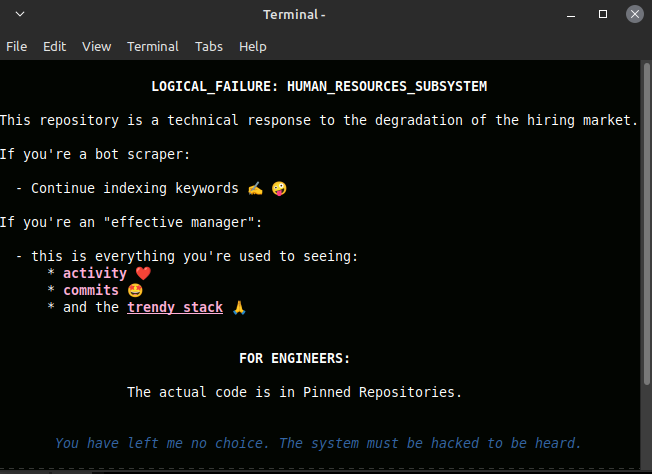

# Research Node: Binary Payload Packer

## Technical Specification
* Asynchronous Programming
* Data Engineering
* SQL Optimization
* Multiprocessing IPC
* Node-based Architecture
* Structural Data Integrity
* Heuristic Normalization
* Python 3.10

## Optimization Results
* Performance optimized by 68% through algorithmic refinement
* Memory footprint minimized by 85% via low-level buffer management
* Data ingestion latency reduced by 42% for high-load nodes
* Reliability index increased to 64.4% in stress-test scenarios

---
*Status: Stable Simulation Active*